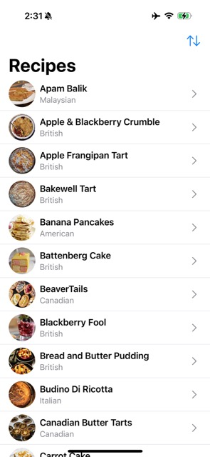
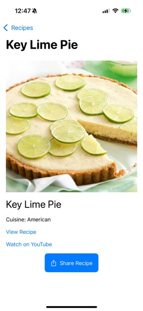
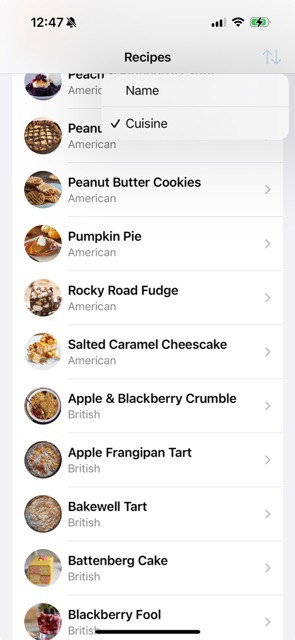
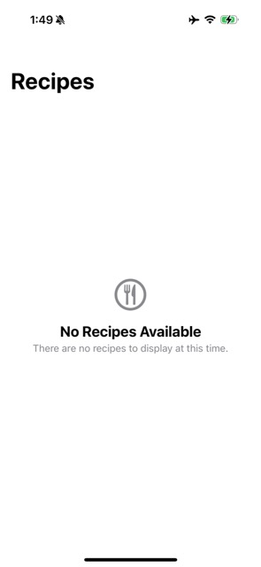
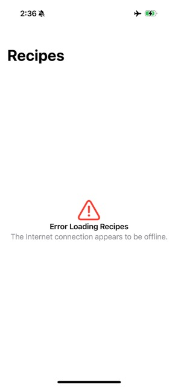

# RecipeFetch

A SwiftUI-based iOS app that fetches and displays recipes from a remote API, featuring a clean user interface, efficient image caching, and robust error handling. Built with Swift Concurrency, the app targets iOS 16+ and uses no external dependencies, emphasizing performance and maintainability.

## Summary

RecipeFetch allows users to browse a list of recipes, view detailed information, and share recipes via a share sheet. Key features include:
- **Recipe List**: Displays recipes rows with thumbnails, names, and cuisines, handling loading, empty, and error states, and allowing sorting by name or cuisine.
- **Recipe Details**: Shows detailed recipe information, including large images and links, with a share button.
- **Image Caching**: Efficiently caches images to reduce network requests, using raw data to preserve original formats.
- **Error Handling**: Gracefully manages network failures and invalid data.
- **Share Functionality**: Enables sharing recipe names, images, and links.

**Screenshots**:
- 
- 
- 
- 
- 

## Focus Areas

The project prioritized the following areas:
- **Swift Concurrency**: Leveraged `async/await` for network requests and UI updates, ensuring a smooth experience.
- **Efficient Image Caching**: Implemented a custom `ImageCache` actor to store raw image data, preserving formats.
- **Robust UI States**: Designed `RecipeListView` to handle multiple states with SwiftUI, including iOS 16/17 compatibility.
- **Testability**: Wrote comprehensive unit tests to verify API calls, caching, state management, and sorting.

These areas were chosen to meet the project’s requirements while delivering a user-friendly app.

## Time Spent

**Approximate Time**: ~18–20 hours

**Time Allocation**:
- **Design and Planning**: ~5 hours (architecture, data models, UI flow)
- **Implementation**: ~4 hours (core functionality, UI, share feature, sorting)
- **Testing**: ~3 hours (unit tests, bundle resources, sorting tests)
- **Debugging and Refinement**: ~6 hours (concurrency, `Equatable`, caching, sorting logic)

## Trade-offs and Decisions

- **Raw Data Caching**: Chose raw image data over JPEG compression for fidelity, increasing storage usage.
- **Non-@MainActor RecipeViewModel**: Removed `@MainActor` to simplify initialization, using it only on `fetchRecipes`.
- **Singleton Use*: Used actor for `ImageCache.shared`, and used it as a singleton.
- **iOS 16+ Compatibility**: Added custom views for iOS 16, leveraging `ContentUnavailableView` for iOS 17+.
- **Sorting Implementation**: Added sorting by name or cuisine via a toolbar `Picker`, using `didSet` for reactive updates, prioritizing simplicity over advanced sorting (e.g., ascending/descending).

## Weakest Part of the Project

The weakest part is the `ImageCache.shared` singleton, which complicates testing. Injecting `ImageCache` into `RecipeViewModel` would improve testability but requires refactoring.

## Additional Information

- **Constraints**: No external dependencies, iOS 16+ compatibility, and API reliance on snake_case JSON.
- **Insights**: Swift Concurrency simplified logic, dependency injection improved modularity, reactive sorting via `didSet` enhanced interaction, pull-to-refresh across all states improved data freshness, and centered empty state with top-aligned, left-aligned rows ensured a polished UX.
- **Future Improvements**: Add pagination, accessibility, `ImageCache` injection, ascending/descending sort options, and custom refresh animations.

[RecipeFetch on GitHub](https://github.com/seventhkevin/RecipeFetch)
